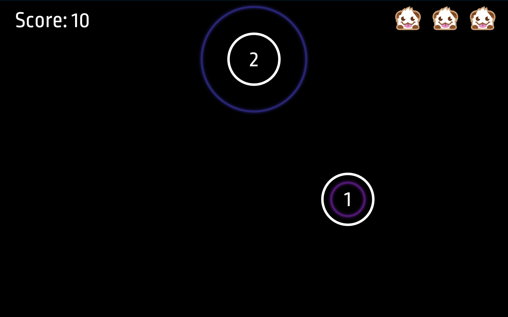

# Audipop

Audipop is a web-based rhythm game. 

It is currently a work in progress. 

Beta version is [available to play on Heroku](https://audipop-test.herokuapp.com/).

## To Do 
- [x] Fix autoRemove bug
- [x] Remove poros as player loses lives  
- [x] Add 2nd circle batch
- [x] Add 3rd circle batch 
- [x] Add animation to circles
- [x] Sync circle timing to music
- [x] Fix score text placement
- [x] Add "Play Again?" button to end screen
- [ ] Add indicator when player loses a life 
- [ ] Incorporate TypeScript

## Future Implementation 
- Backend
- Combo counter 
- Flashy images for combos 